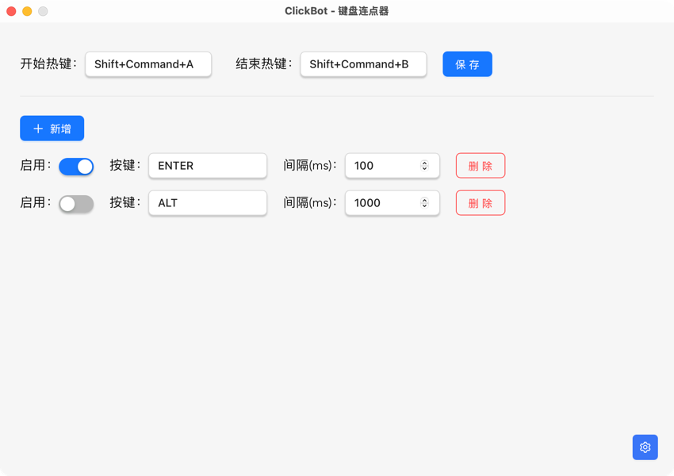

# 键盘连点器 - ClickBot

## 介绍 Intro

简单的键盘连点器，支持多个按键，自定义开始、结束快捷键，自定义每个按键的连点间隔。

シンプルなキーボード連打ツールで、複数のキーをサポートし、開始および終了のショートカットキーをカスタマイズでき、各キーの連打間隔を設定できます。

A simple keyboard auto-clicker that supports multiple keys, allows customization of start and stop hotkeys, and lets you set the interval for each key's auto-clicking.




## 编译 Build

```shell
yarn tauri build
```

## 开源协议 License

Copyright (c) 2025 [Neo](https://github.com/aowubulao)
